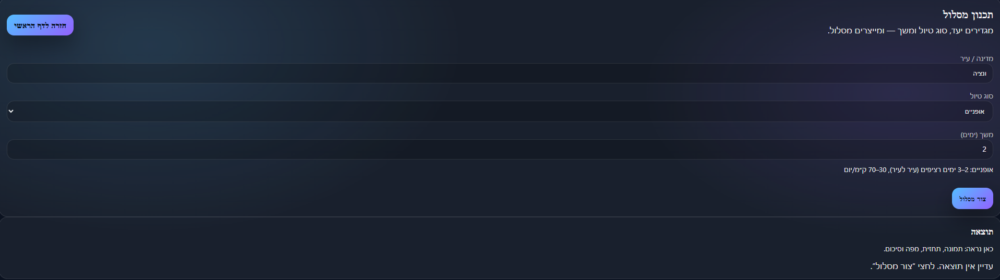
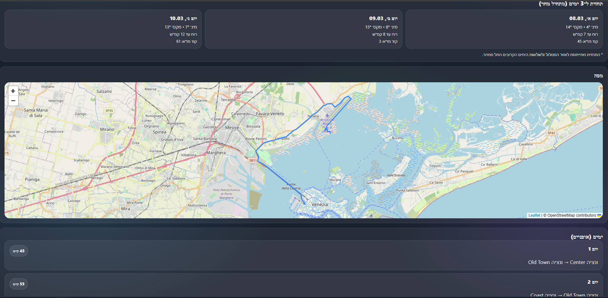
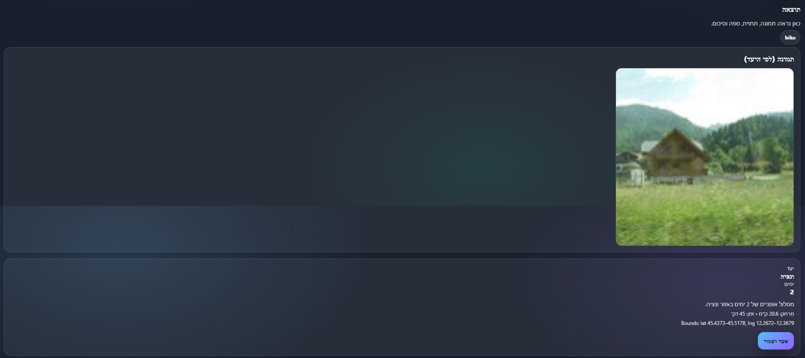
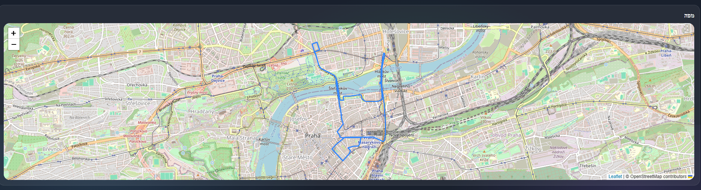
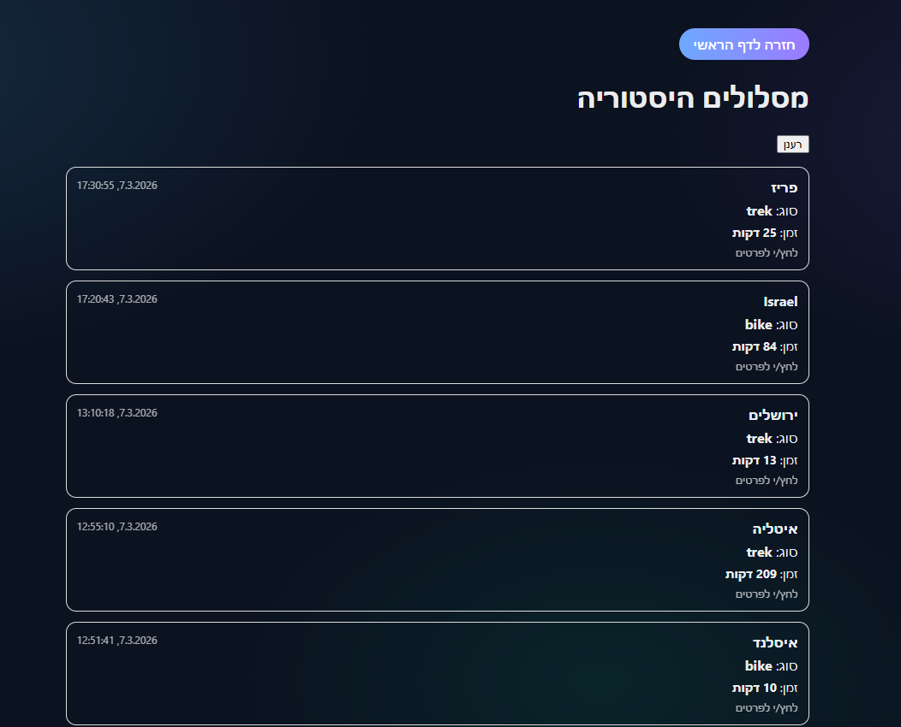
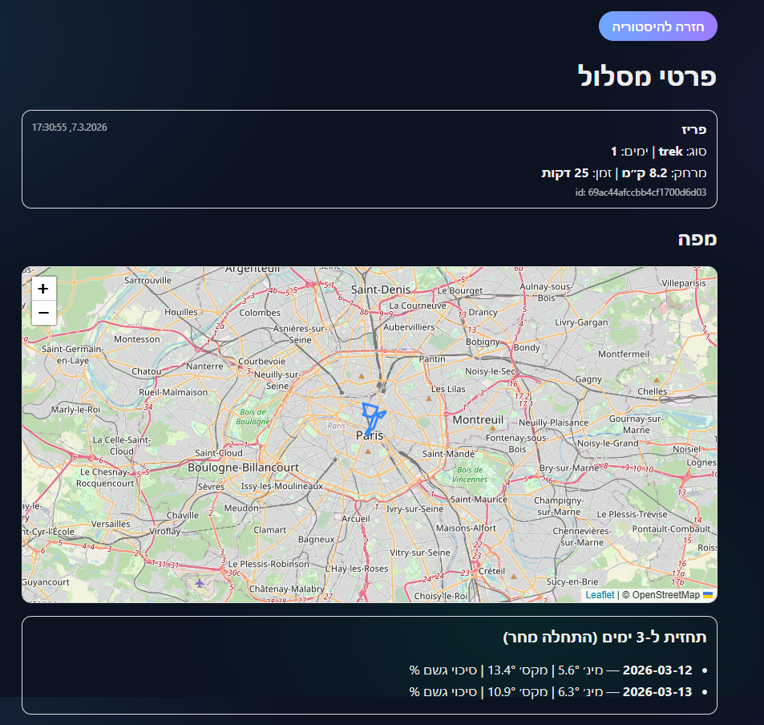

# WEB Final Project – Afeka Trips 2026

## Authors
- Nikol Pinchevsky
- May Shabat

---

# Project Overview

**Afeka Trips 2026** is a full-stack web application developed as the final project for the **Web Development course at Afeka College (2026)**.

The system allows users to generate travel routes based on location, trip type, and trip duration, visualize them on an interactive map, and view weather forecasts for the destination.

Users can save trips to a database and access them later through a personal history page.

The system architecture follows the project requirements and is built using **two servers**:

- **Express Server** – Handles authentication, database operations, and API endpoints.
- **Next.js Server** – Handles the frontend interface, protected pages, and communication with the backend.

---
# Table of Contents

- Project Overview
- Main Features
- System Architecture
- Technologies Used
- Project Structure
- How to Run Locally
- Live Demo
- Screenshots
- Known Issues
- Future Improvements

## Project Presentation

📄 [View Slides (PDF)](./docs/Afeka-Trips-2026-Presentation.pdf)

📥 [Download PPTX](./docs/Afeka-Trips-2026-Presentation.pptx)
---

# Main Features

## Authentication

The system includes a full authentication flow.

Features include:

- User registration
- User login
- Password hashing using **bcrypt**
- JWT based authentication
- Access and refresh tokens stored in **cookies**
- Protected pages using **Next.js Middleware**
- Silent token refresh mechanism

### Authentication Flow

- User logs in → server creates access + refresh tokens
- Tokens are stored in HTTP-only cookies
- Access token is used for protected routes
- If expired → refresh token generates a new one automatically

## Middleware Protection

The Next.js middleware protects restricted pages such as the planner and history pages.

- Checks if access token exists
- If missing → tries refresh using refresh token
- If still invalid → redirects user to login
---

## Planner Page

The user can generate a new trip by selecting:

- Country / city / location
- Trip type (bike or trek)
- Number of days

The system then generates a trip and displays:

- Route summary
- Interactive map with the generated route
- Weather forecast for the next days
- Destination image

---

## Real Route Generation

Routes are generated using real road and trail routing services instead of simple straight-line paths.

This provides realistic trip routes suitable for hiking or cycling.

---

## Save Trip

After reviewing the generated route, the user can approve and save it.

Saved trips are stored in **MongoDB** and linked to the authenticated user.

---

## History Page

Users can view all previously saved trips.

Each trip can be opened to see:

- Full trip details
- Route map
- Weather forecast
- Trip statistics

---

# System Architecture

The application is built using **two independent servers**.

### Next.js Server

Responsible for:

- Frontend UI
- Page routing
- Protected pages
- API proxy routes (`/api/...`)
- Communication with the Express backend

### Express Server

Responsible for:

- Authentication
- JWT token validation
- Database operations
- Trip storage
- Business logic

The project strictly follows the course requirement of using two separate servers:
- Express server (backend logic and authentication)
- Next.js server (frontend and protected routing)

### Architecture Flow

User → Next.js (Frontend) → Express (Backend) → MongoDB

---

# Technologies Used

## Frontend

- **Next.js**
- **React**
- **TypeScript**
- **Leaflet** (map rendering)
- **Next.js Middleware**

---

## Backend

- **Node.js**
- **Express.js**
- **MongoDB**
- **JWT**
- **bcrypt**
- **cookie-parser**
- **cors**

---

## External APIs / Services

The system integrates with several external services:

- **Nominatim / OpenStreetMap** – Geocoding locations
- **OSRM** – Route generation
- **Open-Meteo** – Weather forecast
- **Image API** – Destination images

---

# Project Structure
afeka-trips-2026
│
├── server-express
│ ├── index.js
│ ├── package.json
│ └── .env
│
└── web-next
├── app
├── components
├── lib
├── middleware.ts
├── package.json
└── .env.local

---

# How to Run the Project Locally

## 1. Clone the repository
git clone https://github.com/nikolpinchevsky/WEB-final-project.git

---

## 2. Install backend dependencies
cd server-express
npm install

---

## 3. Create backend environment file

Create `.env` inside `server-express`.

Example:
PORT=4000
CLIENT_ORIGIN=http://localhost:3000

MONGO_URI=your_mongo_connection_string
DB_NAME=your_database_name

JWT_ACCESS_SECRET=your_access_secret
JWT_REFRESH_SECRET=your_refresh_secret

ACCESS_TTL=15m
REFRESH_TTL=1d

NODE_ENV=development

---

## 4. Run backend server
npm run dev
or
npm start

---

## 5. Install frontend dependencies
cd ../web-next
npm install

---

## 6. Create frontend environment file

Create `.env.local` inside `web-next`.

Example:
NEXT_PUBLIC_API_URL=http://localhost:4000

---

## 7. Run frontend
npm run dev

The application will run at:
http://localhost:3000

---

# Live Demo

Currently the project is configured to run locally.

Frontend:
http://localhost:3000

Backend API:
http://localhost:4000

---

# Screenshots

### Planner Page 

### Map View

### History

---

# Known Issues

- Route generation depends on external services (OSRM) and may occasionally fail.
- Weather data depends on third-party APIs and may have slight delays.
- In rare cases, expired tokens may require the user to log in again.

---

# Future Improvements

Possible future improvements:

- Support for additional trip types
- Improved route optimization
- Better mobile interface
- Integration with additional weather services